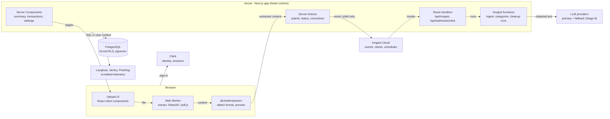
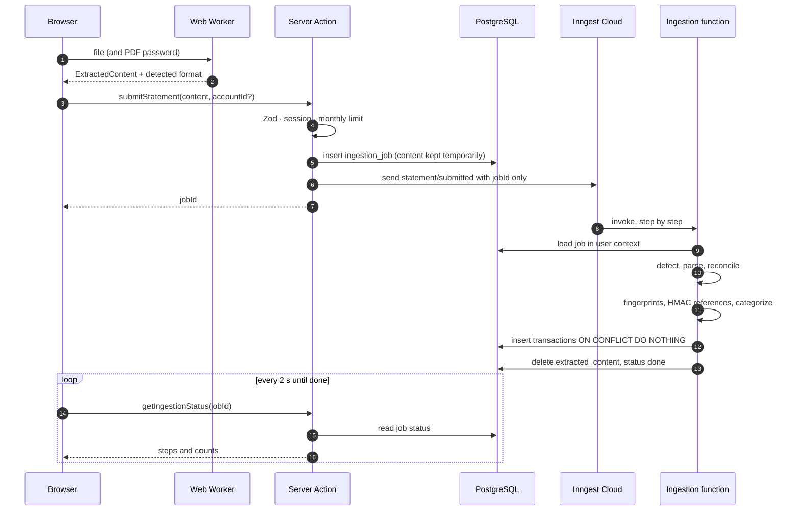
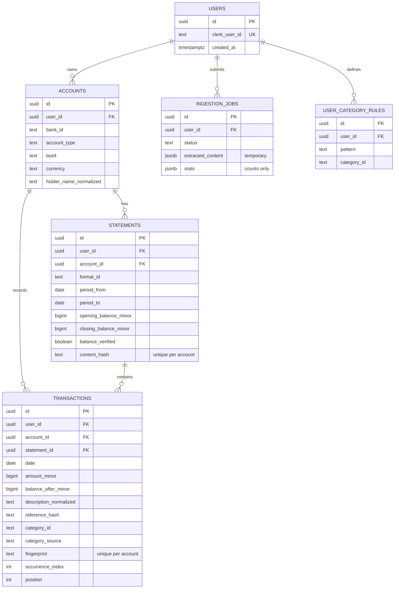
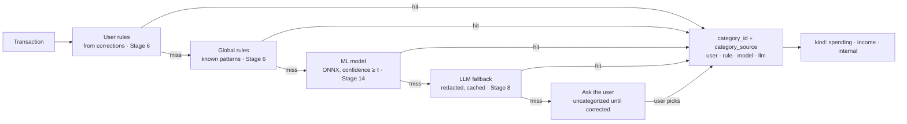
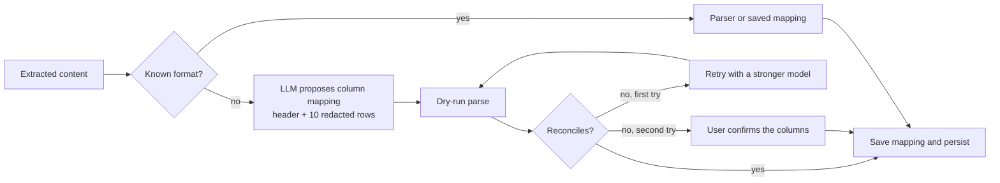
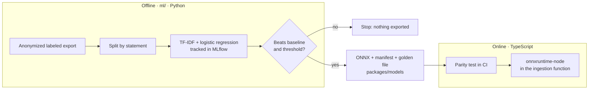
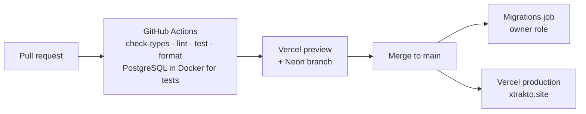

# Xtrakto — System Design

Architecture v1 (planned, October 2026). Stage numbers refer to `docs/ROADMAP.md`. Decisions are recorded as ADRs in `docs/adr/`.

Xtrakto reads Colombian bank statements and explains where the money went: real spending, money that only moved between the user's own accounts, income, recurring payments and fees.

---

## 1. Requirements

### Functional

- Upload a statement (spreadsheet now, PDF in Stage 9) from any supported bank.
- Parse every movement and verify the balances to the cent.
- Separate real spending, money that only moved, and income.
- Categorize movements and let the user correct them.
- Show a summary: categories, month by month, recurring payments, fees and insights.
- Explain cryptic lines in plain Spanish (Stage 8).
- Answer questions about the user's own data (Stage 13).
- Delete or export all of a user's data on request.

### Constraints

- Financial data with PII: the original file and the PDF password never reach the server.
- Amounts as integer minor units; transaction dates as dates without time.
- Serverless hosting: no always-on worker; request bodies up to 4.5 MB on Vercel.
- Free tier with hard cost limits: LLM spend of USD 1 per user per month at most.
- Solo developer: managed services over self-hosted infrastructure.

### Quality attributes

| Attribute                 | Target                                                                                                             | How it is checked                                                                                |
| ------------------------- | ------------------------------------------------------------------------------------------------------------------ | ------------------------------------------------------------------------------------------------ |
| Correctness               | Balances reconcile to the cent. No movement counted twice across overlapping uploads.                              | `reconcile()` on every statement; fingerprints with a unique index; private tests on real files. |
| Privacy                   | Extracted content deleted when its job ends, and after 24 h at most.                                               | Job cleanup step and a daily cron; `docs/data-flow.md`.                                          |
| Isolation                 | A user can never read another user's rows, even through a buggy query.                                             | Forced Row-Level Security plus integration tests.                                                |
| Latency (initial targets) | Spreadsheet ingestion p95 < 10 s without LLM, < 30 s with it. Summary page p95 < 800 ms for a quarter (~500 rows). | Inngest run timings; Sentry performance traces.                                                  |
| Cost                      | Deterministic paths cost nothing. LLM spend capped per user and per platform.                                      | `llm_usage` checked before every call; Langfuse.                                                 |
| Degradation               | If every LLM provider fails, statements still load and summaries still compute; only uncategorized rows wait.      | Fallback chain covered by tests.                                                                 |

---

## 2. Architecture

One Next.js app on Vercel serves pages, receives uploads through server actions and runs the background functions. Slow work leaves the request path through Inngest. Everything that touches money lives in plain TypeScript packages testable without starting the app.

The original file and the PDF password never leave the browser. All database access goes through `@xtrakto/db` inside a transaction that sets `app.user_id`.

| Package or app     | Responsibility                                                                          | Runs in                                      |
| ------------------ | --------------------------------------------------------------------------------------- | -------------------------------------------- |
| `apps/web`         | Routes, UI, server actions, webhooks, Inngest functions                                 | Browser and Vercel                           |
| `@xtrakto/core`    | Domain types, Zod schemas, money, dates, categories, PII redaction, summaries, insights | Anywhere (pure)                              |
| `@xtrakto/parsers` | Spreadsheet and PDF extraction, bank parsers, reconciliation, format detection          | Browser (preview) and server (authoritative) |
| `@xtrakto/db`      | Drizzle schema, migrations, RLS policies, persistence functions                         | Server only                                  |
| `@xtrakto/models`  | Exported ONNX models with manifests and golden files (Stage 14)                         | Server                                       |
| `@xtrakto/evals`   | Labeled datasets and evaluation runners for LLM features (Stage 8)                      | CI and local                                 |
| `ml/`              | Training, evaluation and export of models in Python                                     | Offline only                                 |

---

## 3. Ingestion flow

The upload request only validates and enqueues. Parsing, reconciliation, categorization and persistence run as separate Inngest steps, so each one retries on its own.

- **Events carry IDs only**, because Inngest stores and displays event payloads. The content waits in the job row and is deleted as the last step, or by a daily cron if the job never finishes.
- **Idempotency:** each transaction has a fingerprint (date, normalized description, amount, balance after, occurrence index) with a unique index per account. Re-running a job or re-uploading a file inserts nothing new.
- **Account resolution:** the quarterly statement identifies the account by its last 4 digits; the movements export has no account number, so the user picks the account at upload.
- **Authoritative parse:** the browser parse is only a preview; the server parses again from the same content.
- **Payload size:** only rows or text items travel, to stay under the 4.5 MB request limit.

---

## 4. Privacy boundaries

| Party          | Receives                                                                                      | Never receives                                          | Kept for                                                                          |
| -------------- | --------------------------------------------------------------------------------------------- | ------------------------------------------------------- | --------------------------------------------------------------------------------- |
| User's browser | Original file, PDF password, extracted content                                                | —                                                       | While the page is open                                                            |
| Next.js server | Extracted content (rows or PDF text items)                                                    | Original file, PDF password                             | Not kept; written to the job row                                                  |
| PostgreSQL     | Temporary extracted content; parsed transactions; normalized holder name; HMACs of references | Raw phone numbers, full account numbers, PDF password   | Content: until the job ends (24 h max). Transactions: until the user deletes them |
| Inngest Cloud  | Event names and IDs                                                                           | Any financial content                                   | Inngest run history                                                               |
| LLM providers  | Redacted descriptions; for unknown formats, the header and up to 10 redacted sample rows      | Names, phone numbers, ID and account numbers            | Provider's API data policy                                                        |
| Clerk          | Email, name, sign-in data                                                                     | Financial data                                          | Until the account is deleted                                                      |
| Sentry         | Scrubbed errors and traces                                                                    | Request bodies, action arguments, descriptions, amounts | Sentry retention                                                                  |
| PostHog        | Event names, format ids, count buckets, error codes (after consent)                           | Descriptions, amounts, names                            | PostHog retention                                                                 |
| Langfuse       | Model, tokens, cost, latency                                                                  | Prompt and response content (masked)                    | Langfuse retention                                                                |

**Why HMAC and not a plain hash:** Colombian mobile numbers have 10 digits and start with 3, so a plain SHA-256 can be reversed by trying every number. References are hashed with HMAC-SHA-256 and a secret key, which still allows grouping transfers to the same person.

**Long numbers in descriptions:** a description can carry an account or phone number (`INTERES INV VIRT 27608017525`). Parsers hide all but the last four digits of every run of six or more, keeping the text's length (`INTERES INV VIRT *******7525`), so full numbers never reach the database ([ADR 0012](adr/0012-long-numbers-masked-when-parsed.md)).

---

## 5. Data model

Amounts are `bigint` in minor units. Transaction dates are `date`; real instants are `timestamptz`. Every table except `users` has forced RLS on `user_id`.

Foreign keys skip Row-Level Security, so they also carry `user_id`: a statement references its account by `(account_id, user_id)`, and a movement references its statement by `(statement_id, account_id, user_id)`. A row can't land on another user's account or on a statement of another account. A statement is identified by its `content_hash`: the same file saved twice matches, while a corrected statement for the same period doesn't. `position` keeps the bank's order within a day; `occurrence_index` tells apart identical movements in one statement and is part of the fingerprint. CHECK constraints keep amounts within JavaScript's safe integers and require a finished ingestion job to hold no content.

Later stages add `llm_usage` (8), `format_mappings` without user data (11), `usury_rates` (12) and document chunks with embeddings in pgvector (15).

---

## 6. Categorization

Each transaction falls through the chain until one stage is confident. The LLM only sees what nothing cheaper could classify. No stage computes amounts.

- The category's `kind` drives the headline numbers. Credit card payments, investments and own-account transfers are `internal`: they leave the account but are not spending.
- Own-account transfers are detected by prefix matching against the holder's normalized name, because descriptions truncate names.
- User corrections become user rules and, later, labeled data for the ML model.

---

## 7. Agents

### Ingestion agent for unknown formats (Stage 11)

Known formats never touch the LLM. For a new bank the agent proposes a column mapping, proves it by reconciling, and saves it, so the next file from that bank is parsed deterministically.

Reconciliation is the agent's ground truth. Saved mappings hold column roles and formats, never user data.

### Chat agent (Stage 13)

- Typed tools only: `getTransactions`, `getSpendingByCategory`, `getRecurring`, `getSummary`, `findTransactions`. No model-generated SQL.
- The user id comes from the session inside each tool, never from the model's arguments.
- Transaction descriptions are untrusted data in the prompt; answers cite the transactions used.
- Questions the tools can't answer can run in a Pyodide sandbox in the browser.

---

## 8. ML lifecycle

Python never serves users. Only a model that beats the rule-based baseline is exported; production runs the ONNX file from Node, and a parity test in CI guarantees both languages predict the same.

Splitting by statement, not by row, keeps near-identical movements of one statement out of both train and test.

---

## 9. Infrastructure

|                 | Local                                    | Preview (per PR)           | Production                                                                       |
| --------------- | ---------------------------------------- | -------------------------- | -------------------------------------------------------------------------------- |
| App             | `pnpm dev`                               | Vercel preview deployment  | Vercel production · xtrakto.site                                                 |
| Database        | Docker Compose: PostgreSQL 18 + pgvector | Neon branch                | Neon (AWS us-east-1), `main` branch                                              |
| Auth            | Clerk development instance               | Clerk development instance | Clerk production instance (needs the domain)                                     |
| Background jobs | Inngest dev server                       | Inngest branch environment | Inngest production                                                               |
| Migrations      | `pnpm db:migrate`                        | Applied to the branch      | CI job on `main` with the owner role                                             |
| Secrets         | `.env.local`                             | Vercel preview variables   | Vercel production variables; migration URL as a GitHub secret                    |
| DNS and email   | —                                        | —                          | DNS at Hostinger; Resend on `mail.xtrakto.site` with SPF, DKIM, DMARC (Stage 10) |

Vercel deploys `main` while the migrations job runs, so migrations must stay backward compatible: expand the schema, deploy, then remove what old code used.

---

## 10. Failure modes

| Failure                       | Detected by                       | Behavior                                                                                                         |
| ----------------------------- | --------------------------------- | ---------------------------------------------------------------------------------------------------------------- |
| Unknown format                | No parser matches                 | MVP: clear message. Stage 11: the ingestion agent proposes a mapping.                                            |
| Balances don't add up         | `reconcile()` issues              | Saved with `balance_verified = false`; the summary shows a warning with the affected rows.                       |
| Duplicate upload              | Fingerprint conflict              | Nothing new inserted; the user is told it was already loaded.                                                    |
| Step fails mid-job            | Inngest error                     | Retries of that step only; idempotent writes. On final failure the job is marked failed and its content deleted. |
| LLM timeout or invalid output | Timeout or Zod validation         | One retry on the fallback model; then rows stay uncategorized.                                                   |
| Cost limit reached            | `llm_usage` check before the call | LLM step skipped; the user sees when the limit renews.                                                           |
| Payload too large             | Size checks in browser and action | Rejected with a message; the server enforces the same bounds.                                                    |
| Account deleted in Clerk      | `user.deleted` webhook            | All the user's rows are deleted.                                                                                 |

---

## 11. Scaling path

| Load                  | What changes                                                                                                              |
| --------------------- | ------------------------------------------------------------------------------------------------------------------------- |
| Private beta          | One database. Summaries computed in TypeScript from a period's transactions.                                              |
| Thousands of users    | Aggregates move to SQL with monthly rollups per account. Inngest concurrency keyed by user. Connection pooling tuned.     |
| Hundreds of thousands | Partition `transactions` by user or month. Read replica for dashboards. Model inference in a dedicated service if needed. |

---

## 12. Key decisions

| Decision                                    | Why                                                                     | Alternative considered                                     | ADR                                                                                                   |
| ------------------------------------------- | ----------------------------------------------------------------------- | ---------------------------------------------------------- | ----------------------------------------------------------------------------------------------------- |
| TypeScript backend in Next.js               | One language and one deployment; types shared from UI to database.      | Python API with FastAPI                                    | [0002](adr/0002-typescript-backend-python-for-ml.md)                                                  |
| PostgreSQL with Drizzle                     | Tabular, analytical data; RLS; pgvector.                                | Convex                                                     | [0003](adr/0003-postgresql-with-drizzle.md)                                                           |
| Neon, through `pg` and a pool               | Serverless; a branch per preview; only the database is needed.          | Supabase; Neon's HTTP driver (no interactive transactions) | [0013](adr/0013-neon-for-postgresql.md)                                                               |
| Inngest for background work                 | Long, retryable, step-based jobs on serverless hosting.                 | pg-boss (needs an always-on worker)                        | [0005](adr/0005-inngest-for-background-work.md)                                                       |
| Files read in the browser                   | Original file and PDF password never leave the device; no file storage. | Upload to object storage and parse on the server           | [0008](adr/0008-files-read-in-the-browser.md)                                                         |
| SheetJS for spreadsheets                    | Reads XLSX and CSV in the browser and Node; date cells stay serials.    | ExcelJS (turns dates into `Date` objects)                  | [0011](adr/0011-sheetjs-for-spreadsheet-extraction.md)                                                |
| Events carry IDs only                       | Event payloads are stored and shown by the queue provider.              | Content in the event                                       | [0005](adr/0005-inngest-for-background-work.md)                                                       |
| Deterministic first, LLM as fallback        | Exact, free and testable for known formats.                             | LLM extraction for everything                              | [0009](adr/0009-deterministic-parsing-first.md)                                                       |
| Integer minor units and date-only dates     | No floating-point drift; no time-zone shifts.                           | Decimals and timestamps                                    | [0006](adr/0006-money-as-integer-minor-units.md), [0007](adr/0007-transaction-dates-as-local-date.md) |
| Forced RLS with a transaction-local setting | A second barrier when a query forgets its filter.                       | Application-level filtering only                           | —                                                                                                     |
