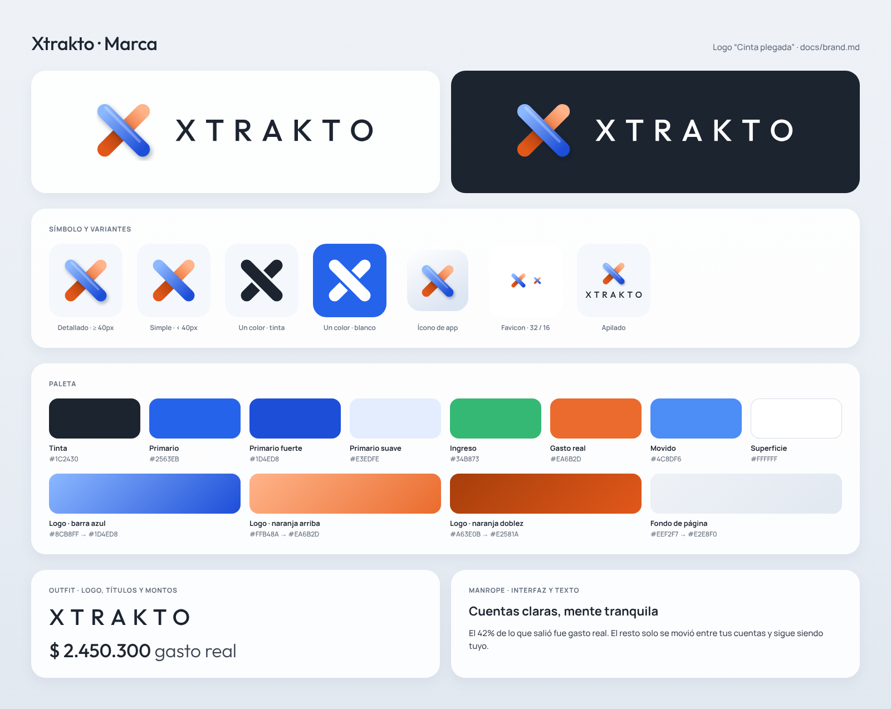

# Xtrakto — Brand

Logo, brand assets and how to use them in the app. It complements `.claude/rules/design-system.md`, which stays the source of truth for UI tokens (colors, type scale, spacing, components).

**Read this before** building the header, auth screens, empty states, emails, the landing page, metadata or anything that shows the logo.



---

## 1. The logo

The logo is **"Cinta plegada" (folded ribbon)**: an X made of two rounded bars.

- The **blue** bar (money that moved, clarity) runs on top, from top-left to bottom-right. It has a soft shadow and a thin highlight.
- The **orange** bar (real spending) passes underneath. Its lower half is darker, as if the ribbon folds under the blue one.
- It reads as the **X of Xtrakto** and repeats the product's two key colors.

The wordmark is `XTRAKTO` in **Outfit 500**, uppercase, with **letter-spacing 0.3em**.

---

## 2. Versions and files

All files live in `apps/web/public/brand/` (served from `/brand/...`).

| Version                      | File                                                                                                                                                     | Use it for                                                                                                  |
| ---------------------------- | -------------------------------------------------------------------------------------------------------------------------------------------------------- | ----------------------------------------------------------------------------------------------------------- |
| Horizontal logo (dark text)  | `xtrakto-logo-horizontal.svg`                                                                                                                            | **Default.** Header, landing, emails, docs, light backgrounds                                               |
| Horizontal logo (white text) | `xtrakto-logo-horizontal-white.svg`                                                                                                                      | Dark backgrounds (`#1C2430` or darker)                                                                      |
| Stacked logo                 | `xtrakto-logo-stacked.svg` / `-white.svg`                                                                                                                | Auth screens, splash, square spaces                                                                         |
| Mark, detailed               | `xtrakto-mark.svg`                                                                                                                                       | Mark alone at **40px or more** (app icon, avatar, loading state)                                            |
| Mark, simple                 | `xtrakto-mark-simple.svg`                                                                                                                                | Mark alone **under 40px** (favicon, tabs, compact nav). No shadow or highlight                              |
| Mark, one color              | `xtrakto-mark-mono-ink.svg` / `-mono-white.svg`                                                                                                          | One-color contexts: PDF exports, watermarks, printing, colored or photo backgrounds                         |
| Wordmark only                | `xtrakto-wordmark.svg` / `-white.svg`                                                                                                                    | Rare. Only where the mark is already shown nearby                                                           |
| PNG exports                  | `png/xtrakto-mark-512.png`, `png/xtrakto-mark-1024.png`, `png/xtrakto-logo-horizontal(-white).png` (1200px wide), `png/xtrakto-logo-stacked(-white).png` | Places that don't take SVG (email clients, social profiles, third-party dashboards such as Clerk or Resend) |

The wordmark in the SVG files is **converted to paths**, so the files don't depend on the font being installed.

### App icons and metadata files

| File                                                  | Size       | Notes                                                                         |
| ----------------------------------------------------- | ---------- | ----------------------------------------------------------------------------- |
| `apps/web/src/app/favicon.ico`                        | 16, 32, 48 | Simple mark, transparent background. **Replaces** the create-next-app favicon |
| `apps/web/src/app/icon.svg`                           | vector     | Simple mark. Next.js emits `<link rel="icon" type="image/svg+xml">`           |
| `apps/web/src/app/apple-icon.png`                     | 180×180    | Full-bleed light tile (`#FFFFFF → #DCE5F2`), detailed mark                    |
| `apps/web/src/app/opengraph-image.png`                | 1200×630   | Social preview: logo, tagline, xtrakto.site                                   |
| `apps/web/src/app/opengraph-image.alt.txt`            | —          | Alt text for the OG image                                                     |
| `apps/web/public/icons/icon-192.png` / `icon-512.png` | 192, 512   | PWA icons: rounded light tile, transparent corners                            |
| `apps/web/public/icons/icon-maskable-512.png`         | 512        | PWA maskable: full-bleed tile, mark inside the 80% safe zone                  |

---

## 3. Construction

The mark is drawn on a **64 × 64 grid**. Rebuild it from this spec; never trace or redraw it by hand.

| Layer (bottom to top)       | Geometry                                              | Paint                                           |
| --------------------------- | ----------------------------------------------------- | ----------------------------------------------- |
| Orange, upper half          | line (50,14) → (32,32), stroke 14, round caps         | gradient (50,14) → (32,32): `#FFB48A → #EA6B2D` |
| Orange, folded half         | line (32,32) → (14,50), stroke 14, round caps         | gradient (32,32) → (14,50): `#A63E0B → #E2581A` |
| Shadow _(detailed only)_    | line (15.5,16.5) → (51.5,52.5), stroke 14, round caps | `#0B1A3A` at 35%, Gaussian blur σ 2.2           |
| Blue bar                    | line (14,14) → (50,50), stroke 14, round caps         | gradient (14,14) → (50,50): `#8CB8FF → #1D4ED8` |
| Highlight _(detailed only)_ | line (15,10.5) → (47,42.5), stroke 2.5, round caps    | `#FFFFFF` at 28%                                |

- **Gradients use `gradientUnits="userSpaceOnUse"`** with the coordinates above.
- **One-color version:** both bars in one color. The orange bar is masked by a 20-wide line along the blue bar, which leaves a 3-unit gap so the overlap still reads.
- **Inlining several marks on one page:** every `id` (gradients, filter, mask) must be unique. The React component below uses `useId()` for that.

### Horizontal lockup proportions

The mark box is 64 units.

- Wordmark font size = **0.45 × mark box** (29 units).
- Gap between the mark box and the text = **0.26 × mark box** (17 units).
- The wordmark's cap height is centered on the mark's center.

### Stacked lockup

The mark sits on top, centered. The wordmark is below, centered, with font size **0.31 × mark box** and a 10-unit gap.

---

## 4. Wordmark

| Property       | Value                                                                                      |
| -------------- | ------------------------------------------------------------------------------------------ |
| Text           | `XTRAKTO` (always uppercase; never "Xtrakto" in the logo)                                  |
| Font           | Outfit 500                                                                                 |
| Letter-spacing | **0.3em**, plus `margin-right: -0.3em` so the trailing tracking doesn't push it off-center |
| Color          | `#1C2430` (`--color-ink`) on light, `#FFFFFF` on dark                                      |

In running text, write the name as **Xtrakto** (capital X, rest lowercase).

> **Supersedes `.claude/rules/design-system.md` §2:** the wordmark letter-spacing changes from `0.34em` to **`0.3em`**, and the header shows the **mark + wordmark** (see §8). The "Extractos" descriptor next to the wordmark is optional and only for the app header.

---

## 5. Clear space and minimum sizes

- **Clear space:** keep at least **¼ of the mark height** empty on every side of the logo. Nothing else goes there: text, edges or other icons.
- **Minimum sizes:**
  - Horizontal logo: **112px** wide.
  - Stacked logo: **64px** wide.
  - Detailed mark: **40px**. Below that, switch to the simple mark (the `LogoMark` component does this automatically).
  - Simple mark: **16px**.

---

## 6. Backgrounds

| Background                                                            | Use                                                                                   |
| --------------------------------------------------------------------- | ------------------------------------------------------------------------------------- |
| Design-system light surfaces (`--bg`, white cards, `--surface-muted`) | Full-color logo, dark wordmark                                                        |
| Ink / dark (`#1C2430`, `#0F151D`)                                     | Full-color mark, **white** wordmark                                                   |
| Primary blue, orange or any saturated color                           | One-color **white** mark and wordmark                                                 |
| Photos or busy images                                                 | Avoid. If you must, use the one-color white version on a dark overlay of at least 40% |

---

## 7. Don'ts

- Don't recolor the bars, swap blue and orange, or put the orange bar on top.
- Don't rotate, skew, stretch or mirror the mark.
- Don't add outlines, extra glows or 3D effects; the shadow and highlight are already part of the detailed mark.
- Don't use the detailed mark under 40px. The blur turns to mud; use the simple mark.
- Don't set the wordmark in another font or weight, or change its tracking.
- Don't place the logo inside a box or pill unless it's an app-icon tile.
- Don't use the logo colors (`#8CB8FF`, `#FFB48A`, `#A63E0B`, `#E2581A`) as UI colors. They exist only inside the mark; the UI uses the tokens in `.claude/rules/design-system.md`.

---

## 8. Using the logo in the app

### Header

The header uses the **`Logo` component** (inline mark + live text). It doesn't use the SVG file, so the wordmark inherits `next/font`, stays crisp, and can switch color with the theme.

- **Desktop:** mark at 32px.
- **Mobile:** mark at 28px.
- The whole logo links to `/` with `aria-label="Xtrakto, inicio"`.

### Reference component

Put it where `.claude/rules/project-architecture-rules.md` places shared UI (for example `apps/web/src/components/brand/Logo.tsx`). It's a Server Component: `useId` works there, so no `"use client"` is needed. It uses the Tailwind tokens from `.claude/rules/design-system.md` (`font-display`, `text-ink`).

```tsx
import { useId } from "react";

type MarkVariant = "detailed" | "simple";

interface LogoMarkProps {
  size?: number;
  variant?: MarkVariant;
  title?: string; // set it when the mark stands alone; omit when the wordmark is next to it
  className?: string;
}

export function LogoMark({
  size = 32,
  variant,
  title,
  className,
}: LogoMarkProps) {
  const id = useId().replace(/[^a-zA-Z0-9_-]/g, "");
  const detailed =
    (variant ?? (size >= 40 ? "detailed" : "simple")) === "detailed";
  const a11y = title
    ? { role: "img", "aria-label": title }
    : { "aria-hidden": true };
  return (
    <svg
      viewBox="0 0 64 64"
      width={size}
      height={size}
      className={className}
      {...a11y}
    >
      <defs>
        <linearGradient
          id={`${id}b`}
          gradientUnits="userSpaceOnUse"
          x1="14"
          y1="14"
          x2="50"
          y2="50"
        >
          <stop offset="0" stopColor="#8CB8FF" />
          <stop offset="1" stopColor="#1D4ED8" />
        </linearGradient>
        <linearGradient
          id={`${id}o`}
          gradientUnits="userSpaceOnUse"
          x1="50"
          y1="14"
          x2="32"
          y2="32"
        >
          <stop offset="0" stopColor="#FFB48A" />
          <stop offset="1" stopColor="#EA6B2D" />
        </linearGradient>
        <linearGradient
          id={`${id}f`}
          gradientUnits="userSpaceOnUse"
          x1="32"
          y1="32"
          x2="14"
          y2="50"
        >
          <stop offset="0" stopColor="#A63E0B" />
          <stop offset="1" stopColor="#E2581A" />
        </linearGradient>
        {detailed && (
          <filter id={`${id}s`} x="-30%" y="-30%" width="160%" height="160%">
            <feGaussianBlur stdDeviation="2.2" />
          </filter>
        )}
      </defs>
      <g strokeLinecap="round" strokeWidth="14">
        <line x1="50" y1="14" x2="32" y2="32" stroke={`url(#${id}o)`} />
        <line x1="32" y1="32" x2="14" y2="50" stroke={`url(#${id}f)`} />
        {detailed && (
          <line
            x1="15.5"
            y1="16.5"
            x2="51.5"
            y2="52.5"
            stroke="#0B1A3A"
            strokeOpacity=".35"
            filter={`url(#${id}s)`}
          />
        )}
        <line x1="14" y1="14" x2="50" y2="50" stroke={`url(#${id}b)`} />
      </g>
      {detailed && (
        <line
          x1="15"
          y1="10.5"
          x2="47"
          y2="42.5"
          stroke="#FFFFFF"
          strokeOpacity=".28"
          strokeWidth="2.5"
          strokeLinecap="round"
        />
      )}
    </svg>
  );
}

interface LogoProps {
  size?: number; // mark size in px
  tone?: "ink" | "white";
  className?: string;
}

export function Logo({ size = 32, tone = "ink", className }: LogoProps) {
  const color = tone === "white" ? "text-white" : "text-ink";
  return (
    <span
      className={`inline-flex items-center ${className ?? ""}`}
      style={{ gap: size * 0.26 }}
    >
      <LogoMark size={size} />
      <span
        className={`font-display font-medium uppercase tracking-[0.3em] mr-[-0.3em] leading-none ${color}`}
        style={{ fontSize: size * 0.45 }}
      >
        Xtrakto
      </span>
    </span>
  );
}
```

The text node is "Xtrakto" with `uppercase`, so screen readers say the name instead of spelling X-T-R-A-K-T-O.

### Metadata (root `layout.tsx`)

```ts
import type { Metadata, Viewport } from "next";

export const metadata: Metadata = {
  metadataBase: new URL("https://xtrakto.site"),
  title: { default: "Xtrakto", template: "%s · Xtrakto" },
  description:
    "Entiende tu extracto bancario: en qué gastaste, qué solo moviste y cuánto entró.",
  applicationName: "Xtrakto",
};

export const viewport: Viewport = {
  themeColor: "#EEF2F7",
};
```

`favicon.ico`, `icon.svg`, `apple-icon.png` and `opengraph-image.png` in `src/app/` are picked up automatically by Next.js. Don't add `<link>` tags by hand.

### Web manifest (`apps/web/src/app/manifest.ts`)

```ts
import type { MetadataRoute } from "next";

export default function manifest(): MetadataRoute.Manifest {
  return {
    name: "Xtrakto",
    short_name: "Xtrakto",
    description: "Cuentas claras, mente tranquila",
    lang: "es",
    start_url: "/",
    display: "standalone",
    background_color: "#EEF2F7",
    theme_color: "#EEF2F7",
    icons: [
      { src: "/icons/icon-192.png", sizes: "192x192", type: "image/png" },
      { src: "/icons/icon-512.png", sizes: "512x512", type: "image/png" },
      {
        src: "/icons/icon-maskable-512.png",
        sizes: "512x512",
        type: "image/png",
        purpose: "maskable",
      },
    ],
  };
}
```

### Third-party services

Upload `png/xtrakto-mark-512.png` as the app logo in Clerk, Resend and Sentry. Use `png/xtrakto-logo-horizontal.png` for the header of transactional emails, at a display width of 160px (the 1200px file keeps it sharp on retina).

---

## 9. Palette

Full UI tokens and contrast rules are in `.claude/rules/design-system.md` §3, and the Tailwind `@theme` block in §13. Summary:

### Brand and UI

| Role                         | Hex                           | Token                    |
| ---------------------------- | ----------------------------- | ------------------------ |
| Ink (text, dark backgrounds) | `#1C2430`                     | `--color-ink`            |
| Text secondary               | `#3A4452`                     | `--color-ink-secondary`  |
| Text muted                   | `#5F6B7A`                     | `--color-ink-muted`      |
| Primary                      | `#2563EB`                     | `--color-primary`        |
| Primary strong               | `#1D4ED8`                     | `--color-primary-strong` |
| Primary soft                 | `#E3EDFE`                     | `--color-primary-soft`   |
| Background                   | `#EEF2F7 → #E9EEF4 → #E2E8F0` | `--bg`                   |
| Surface                      | `#FFFFFF`                     | `--color-surface`        |

### Meaning colors (never decorative)

| Kind          | Graphic   | Text      | Soft background |
| ------------- | --------- | --------- | --------------- |
| Income        | `#34B873` | `#15803D` | `#E3F6EC`       |
| Real spending | `#EA6B2D` | `#C2410C` | `#FDEEE4`       |
| Moved         | `#4C8DF6` | `#2563EB` | `#E3EDFE`       |

### Logo-only colors

Use these only inside the mark: `#8CB8FF`, `#1D4ED8` (blue bar); `#FFB48A`, `#EA6B2D` (orange top); `#A63E0B`, `#E2581A` (orange fold); `#0B1A3A` (shadow).

The app-icon tile gradient is `#FFFFFF → #DCE5F2`.

---

## 10. Typography

| Use                        | Font                                                                                 |
| -------------------------- | ------------------------------------------------------------------------------------ |
| Wordmark, display, amounts | **Outfit** (300, 400, 500, 600), loaded with `next/font/google` as `--font-outfit`   |
| UI and body                | **Manrope** (400, 500, 600, 700), loaded with `next/font/google` as `--font-manrope` |

See `.claude/rules/design-system.md` §4 for the type scale.

---

## 11. Voice

| Item     | Value                                                        |
| -------- | ------------------------------------------------------------ |
| Name     | Xtrakto                                                      |
| Domain   | xtrakto.site                                                 |
| Tagline  | "Cuentas claras, mente tranquila"                            |
| Language | Spanish (Colombia); use "tú", plain words, no banking jargon |

See `.claude/rules/design-system.md` §11 for copy rules.
